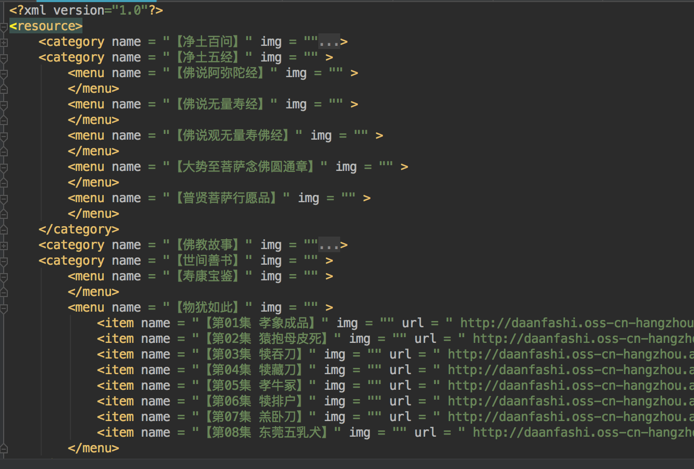
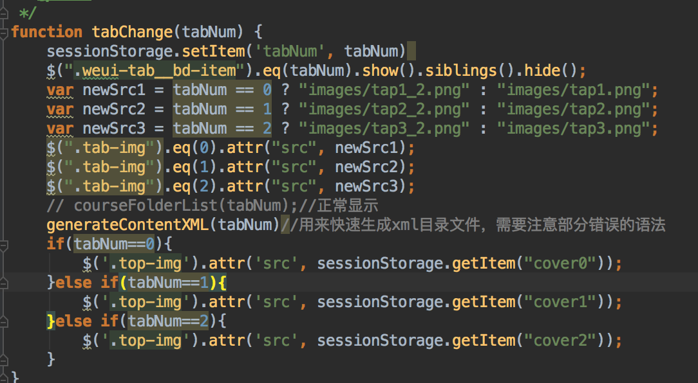
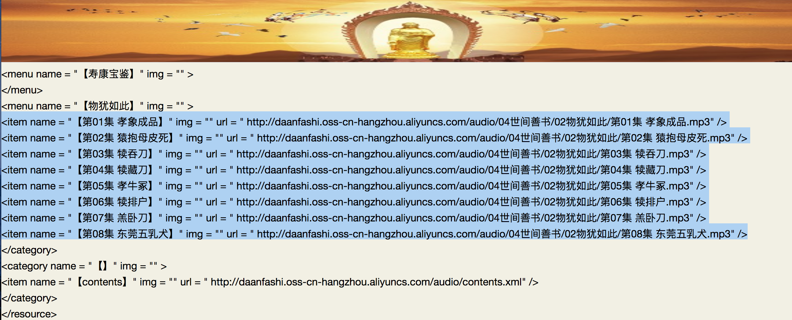
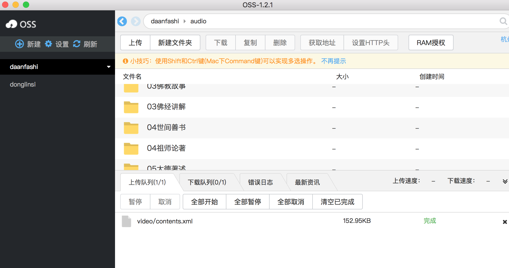

# 视频音频播放显示简介

### 1、显示的目录文件

前端界面html5+js，通过ajax获取阿里云对应目录下的contents.xml文件，该文件的格式如下：

| 标签名称 | 介绍 |
|--------|--------|
|    category    |   一级目录，可以设置名字和图片路径。     |
|    menu    |   二级目录，可以设置名字和路径。     |
|    item    |   视频或者音频文件，可以配置名字和图片，还需要设置对应的文件路径。     |

### 2、目录文件快速生成方法
为了方便快速生成该文件，可以通过main.js里面的generateXML文件生成对应的一些数据，具体的生成方式可以自动调整。

 
`courseFolderList`是正常显示的方法。`generateContentXML`用于生成数据，显示的效果大概如下：

选取需要的部分放到contents.xml文件里即可。

如果需要自己实现的话可以修改对应的`generateContentXML`方法。

### 3、文件上传

使用oss的客户端工具即可。
